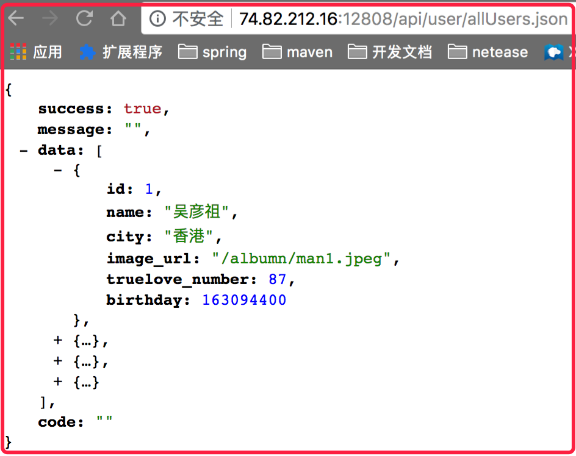
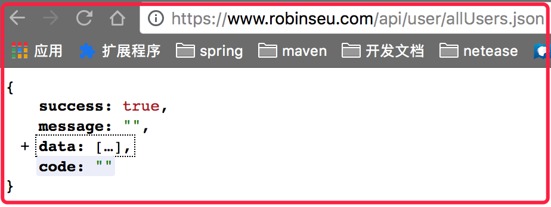

##  PART1:后端部署到服务器（centos7）
### 1、下载源码到服务器
新建源码文件夹
 ```
 mkdir /var/code
 cd /var/code
 git clone https://github.com/robin2017/koa2-praylove.git
 ```
### 2、创建数据库并修改配置
##### 首先创建pray_love数据库
``` mysql -uroot -p -e "create database pray_love character set utf8mb4"```
##### 然后插入结构和模拟数据
``` mysql -uroot -p pray_love < /var/code/koa2-praylove/init/sql/user.sql```

### 3、运行并验证
先将config.js中数据库密码修改为你的密码
然后运行服务器
 ```
cd /var/code/koa2-praylove
npm install
node ./server/app.js
 ```


 得到如下界面表明后端运行成功

### 4、配置域名及https
 过程略，最终结果为：
 
## PART2:小程序端运行
### 1、下载源码
 ```
git clone https://github.com/robin2017/mpvue-demo.git
 ```
### 2、修改URL
 将'src/utils/request.js'中baseURL修改为你的https链接
比如
```
export const baseURL = 'https://www.robinseu.com';
```
### 3、运行
```
npm run dev:proxy1
```
此时会生成dist文件夹，用微信开发者工具打开即可，看到如下界面表示运行成功
 